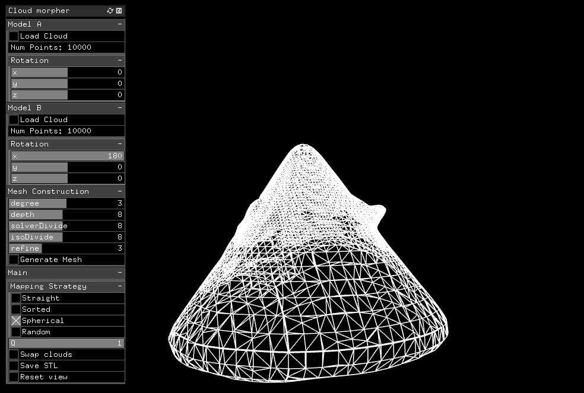
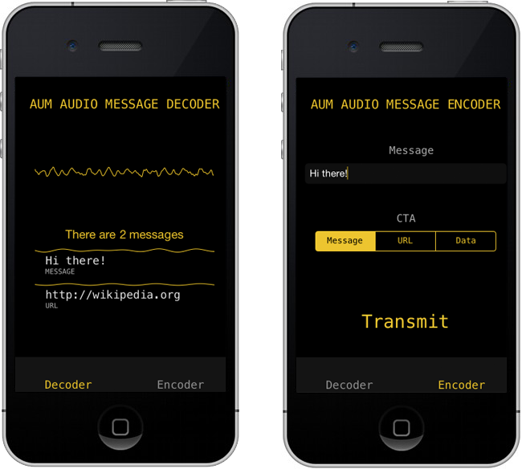
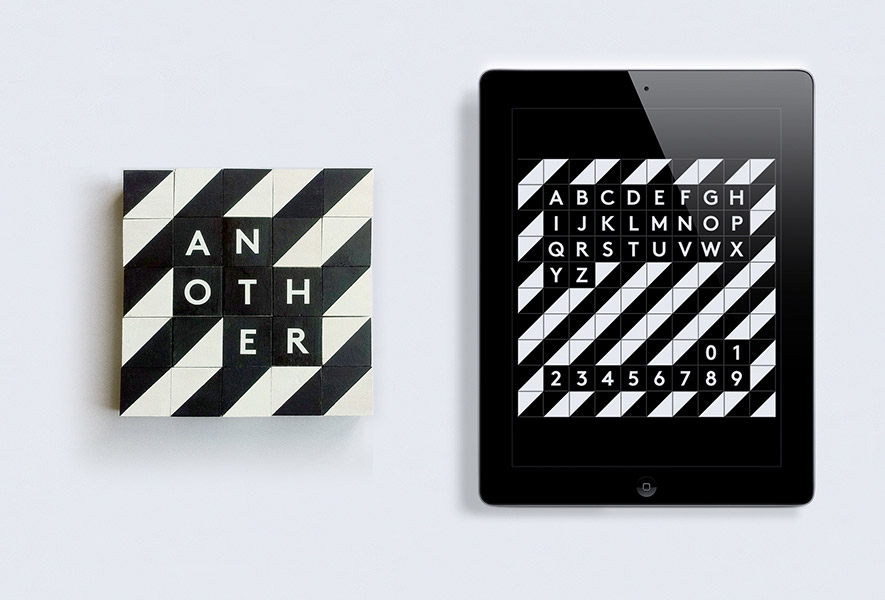

# Samsung Level
## C++, openFrameworks, DMX, MIDI

An openFrameworks application to simulate and map realtime MIDI to over 30 DMX
lights (Sharpys, Nitros and Strobes).

<iframe width="800" height="450" src="https://www.youtube.com/embed/JIjayCgumHQ?rel=0&amp;showinfo=0" frameborder="0" allowfullscreen></iframe>

Working with Chris Cairns I developed an application to light up a
half built theatre. This involved receiving MIDI from a Native
Instruments Maschine and mapping the MIDI to a selection of
lights. The application also send animations to a Novation Launchpad
(via MIDI). Full control over mappings, sequences, colours was
available through the app for tweaking while the shoot.

# Wekinator on the iPhone
## Machine Learning, C++, iOS, openFrameworks

<iframe src="https://player.vimeo.com/video/125445510?title=0&byline=0&portrait=0" width="800" height="450" frameborder="0" webkitallowfullscreen mozallowfullscreen allowfullscreen></iframe>

Working with the EAVI group at Goldsmiths I wrote a prototype iOS app to implement
the general concept of Rebecca Fiebrink's Wekinator. This creates intuitive musical
instruments, by learning how you want the instrument to behave.

Under the hood it uses regression via a neural network to estimate
the function of the control (for example filter cutoff) with respect
to orientation.

I presented a talk about the app at the Guerilla Science tent at
Secret Garden Party 2014.

# Samsung 360
## C++, d3

Sound reactive visuals to showcase a speaker.

<iframe width="800" height="450" src="https://www.youtube.com/embed/qjuPh2qI8ts?rel=0&amp;showinfo=0" frameborder="0" allowfullscreen></iframe>

Working at Artisan (the commercial branch of United Visual Artists),
I co-wrote a d3 module in C++ for projecting visuals onto a large screen. 

# AMorpher
## C++, openFrameworks, surface reconstruction, 3D modelling

For Alicia Ongar Perez sculptor I created a application to import two STL models,
interpolate between 3D shapes and export.

I created a tool to move between two 3D models. There were two main
challenges here; the first was how do you move between two volumes and
the second was how do you create a water-tight, 3D print-able shape.

To address the first problem, I first resampled all meshes in meshlab
to have the same number of points and then I wrote a number of
tranformations, but the most succesful was what I called a spherical
mapping. This projected all points in the mesh onto the sphere that
encompassed all these points, then points from the second mesh were
mapped onto the closest points on this sphere.

For the second problem, I used Poisson Surface Reconstruction to
create a mesh that could be exported to STL.

# Inflated Egos
## Python, OSC, websockets, openFrameworks, Twitter API, tmux, Arduino, SQLite, MongoDB

<iframe src="https://player.vimeo.com/video/126641509?title=0&byline=0&portrait=0" width="800" height="340" frameborder="0" webkitallowfullscreen mozallowfullscreen allowfullscreen></iframe>

Four Intel NUCs running Xbuntu, each driving two monitors, displaying live Tweets.
Another machine running an openFrameworks app to detect balloon sizes
with a Kinect. An Arduino to control the size of the balloon. Lots of OSC, websockets and some serial.

Databases (SQLite & MongoDB) were used to store data and also cache
tweets, in order to play a recorded period of time.

# AUM
## C++, DSP, Objective-C, iOS

Working with Pierre Chanquion, I co-wrote a C++ library to transmit messages over ultrasonic audio. The only dependency for the library is fftw. I also wrote an iOS app to demo the library.

# Tryptich
## C++, openFrameworks, Kinect

<iframe src="https://player.vimeo.com/video/46098084?title=0&byline=0&portrait=0" width="800" height="450" frameborder="0" webkitallowfullscreen mozallowfullscreen allowfullscreen></iframe>

Working at Hellicar & Lewis, with Marek Bereza and Diederick Huijbers
I wrote one of the interactive projections for Tryptich. Interaction
was through a Kinect and the application was written in openFrameworks.

# Würfel-Mosaik
## iOS, Objective-C, Facebook API, Twitter API, Core Graphics

<iframe width="800" height="450" src="https://www.youtube.com/embed/WoW7xDYfkyk?rel=0&amp;showinfo=0" frameborder="0" allowfullscreen></iframe>

Working with Matt Watkins I developed an iOS (iPhone & iPad) app to
create the digial version of a classic game from Switzerland.

The app was written in Objective-C, used iCloud for saving
configurations on multiple devices and used social networking APIs to
integrate social media.

